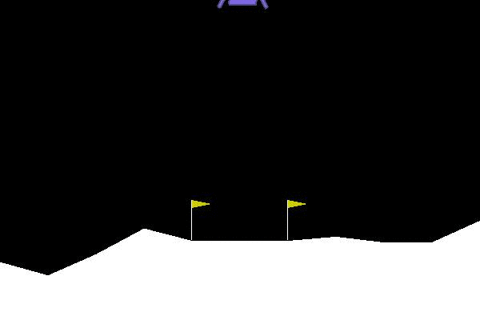

# OpenAI Gym solutions

This repository contains implementations of well-known RL algorithms on PyTorch.

For better performance or production purposes I recommend using <a href='https://github.com/openai/baselines'>OpenAI Baselines</a> implementations.

### Some solved environments

